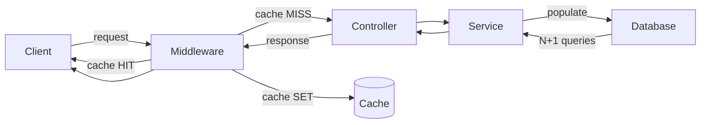

# Performance and Caching

Strapi is fast out of the box for small datasets. At scale -- thousands of entries, deep relations, high traffic -- you need explicit caching, query optimization, and infrastructure tuning.

## Performance bottleneck overview



The three most common bottlenecks:

1. **Deep population** -- every `populate` adds joins
2. **N+1 queries** -- fetching relations one-by-one instead of batched
3. **No response caching** -- identical requests hit the database every time

---

## Response caching

### In-memory cache (simple, single-instance)

Good for small projects, no external dependencies:

```js
// src/api/article/middlewares/cache.js
const cache = new Map();

module.exports = (config, { strapi }) => {
  const ttl = config.ttl || 60000;        // Default 60 seconds
  const maxSize = config.maxSize || 1000;  // Max cached entries

  return async (ctx, next) => {
    // Only cache GET requests
    if (ctx.method !== 'GET') {
      await next();
      // Invalidate cache on writes
      cache.clear();
      return;
    }

    const key = `${ctx.url}|${ctx.get('Authorization') || 'anon'}`;
    const cached = cache.get(key);

    if (cached && Date.now() - cached.timestamp < ttl) {
      ctx.body = cached.body;
      ctx.status = cached.status;
      ctx.set('X-Cache', 'HIT');
      return;
    }

    await next();

    if (ctx.status === 200 && ctx.body) {
      // Evict oldest entry if cache is full
      if (cache.size >= maxSize) {
        const oldest = cache.keys().next().value;
        cache.delete(oldest);
      }

      cache.set(key, {
        body: ctx.body,
        status: ctx.status,
        timestamp: Date.now(),
      });
      ctx.set('X-Cache', 'MISS');
    }
  };
};
```

### Redis cache (production, multi-instance)

```bash
npm install ioredis
```

```js
// src/api/article/middlewares/redis-cache.js
const Redis = require('ioredis');

let redis;

module.exports = (config, { strapi }) => {
  const ttl = config.ttl || 60;  // seconds
  const prefix = config.prefix || 'strapi:cache:';

  if (!redis) {
    redis = new Redis(process.env.REDIS_URL || 'redis://localhost:6379');
  }

  return async (ctx, next) => {
    if (ctx.method !== 'GET') {
      await next();
      // Invalidate related cache on writes
      const pattern = `${prefix}${ctx.url.split('?')[0]}*`;
      const keys = await redis.keys(pattern);
      if (keys.length) await redis.del(...keys);
      return;
    }

    const key = `${prefix}${ctx.url}`;

    try {
      const cached = await redis.get(key);
      if (cached) {
        ctx.body = JSON.parse(cached);
        ctx.set('X-Cache', 'HIT');
        ctx.set('X-Cache-TTL', ttl);
        return;
      }
    } catch (err) {
      strapi.log.warn('[redis-cache] Read error:', err.message);
    }

    await next();

    if (ctx.status === 200 && ctx.body) {
      try {
        await redis.setex(key, ttl, JSON.stringify(ctx.body));
      } catch (err) {
        strapi.log.warn('[redis-cache] Write error:', err.message);
      }
      ctx.set('X-Cache', 'MISS');
    }
  };
};
```

### Applying the cache middleware

```js
// src/api/article/routes/article.js
const { createCoreRouter } = require('@strapi/strapi').factories;

module.exports = createCoreRouter('api::article.article', {
  config: {
    find: {
      middlewares: [
        { name: 'api::article.redis-cache', config: { ttl: 300 } },  // 5 min
      ],
    },
    findOne: {
      middlewares: [
        { name: 'api::article.redis-cache', config: { ttl: 600 } },  // 10 min
      ],
    },
  },
});
```

### Cache invalidation via Document Service middleware

```js
// src/index.js
const Redis = require('ioredis');
const redis = new Redis(process.env.REDIS_URL);

module.exports = {
  register({ strapi }) {
    strapi.documents.use(async (context, next) => {
      const result = await next();

      if (['create', 'update', 'delete', 'publish', 'unpublish'].includes(context.action)) {
        const prefix = 'strapi:cache:';
        const apiName = context.uid.split('.').pop();
        const pattern = `${prefix}/api/${apiName}*`;

        const keys = await redis.keys(pattern);
        if (keys.length) {
          await redis.del(...keys);
          strapi.log.debug(`[cache] Invalidated ${keys.length} keys for ${context.uid}`);
        }
      }

      return result;
    });
  },
};
```

---

## Database optimization

### Adding database indexes

Strapi doesn't add indexes automatically (beyond primary keys). For frequently filtered fields, add them manually:

```js
// database/migrations/2025.01.15T00.00.00.add-indexes.js
module.exports = {
  async up(knex) {
    // Index on slug for lookups
    await knex.schema.alterTable('articles', (table) => {
      table.index('slug');
    });

    // Index on published_at for publication queries
    await knex.schema.alterTable('articles', (table) => {
      table.index('published_at');
    });

    // Composite index for locale + slug queries
    await knex.schema.alterTable('articles', (table) => {
      table.index(['locale', 'slug']);
    });

    // Index on foreign keys (Strapi doesn't always add these)
    await knex.schema.alterTable('articles_author_lnk', (table) => {
      table.index('article_id');
      table.index('author_id');
    });
  },

  async down(knex) {
    await knex.schema.alterTable('articles', (table) => {
      table.dropIndex('slug');
      table.dropIndex('published_at');
      table.dropIndex(['locale', 'slug']);
    });
  },
};
```

### Connection pooling

```js
// config/env/production/database.js
module.exports = ({ env }) => ({
  connection: {
    client: 'postgres',
    connection: {
      host: env('DATABASE_HOST'),
      port: env.int('DATABASE_PORT', 5432),
      database: env('DATABASE_NAME'),
      user: env('DATABASE_USERNAME'),
      password: env('DATABASE_PASSWORD'),
    },
    pool: {
      min: env.int('DATABASE_POOL_MIN', 2),
      max: env.int('DATABASE_POOL_MAX', 10),
      acquireTimeoutMillis: 30000,
      idleTimeoutMillis: 30000,
    },
  },
});
```

---

## Query optimization

### Select only needed fields

```js
// BAD: fetches all 30 fields for each article
const articles = await strapi.documents('api::article.article').findMany({
  populate: '*',
});

// GOOD: only fetch what the frontend needs
const articles = await strapi.documents('api::article.article').findMany({
  fields: ['title', 'slug', 'publishedAt'],
  populate: {
    author: { fields: ['name'] },
    cover: { fields: ['url', 'alternativeText', 'width', 'height'] },
  },
});
```

### Avoid deep population

```js
// BAD: 4 levels of nesting
const articles = await strapi.documents('api::article.article').findMany({
  populate: {
    author: {
      populate: {
        company: {
          populate: {
            employees: {
              populate: ['avatar'],
            },
          },
        },
      },
    },
  },
});

// GOOD: fetch only what's needed, make separate queries if needed
const articles = await strapi.documents('api::article.article').findMany({
  fields: ['title', 'slug'],
  populate: {
    author: { fields: ['name', 'avatar'] },
  },
});
```

### Pagination: always paginate

```js
// BAD: loads all articles into memory
const all = await strapi.documents('api::article.article').findMany({});

// GOOD: paginate
const page1 = await strapi.documents('api::article.article').findMany({
  page: 1,
  pageSize: 25,
});
```

---

## CDN integration

### Serving media through a CDN

```js
// config/middlewares.js
module.exports = [
  // ...
  {
    name: 'strapi::security',
    config: {
      contentSecurityPolicy: {
        directives: {
          'img-src': ["'self'", 'data:', 'cdn.example.com', '*.cloudinary.com'],
        },
      },
    },
  },
  // ...
];
```

### Setting cache headers for API responses

```js
// src/middlewares/cache-headers.js
module.exports = (config, { strapi }) => {
  const maxAge = config.maxAge || 60;

  return async (ctx, next) => {
    await next();

    if (ctx.method === 'GET' && ctx.status === 200) {
      // Public endpoints can be cached by CDN
      if (!ctx.state.user) {
        ctx.set('Cache-Control', `public, max-age=${maxAge}, s-maxage=${maxAge * 2}`);
        ctx.set('Vary', 'Accept, Accept-Encoding');
      } else {
        ctx.set('Cache-Control', 'private, no-cache');
      }
    }
  };
};
```

### Stale-while-revalidate pattern

```js
ctx.set(
  'Cache-Control',
  `public, max-age=60, s-maxage=300, stale-while-revalidate=600`
);
// CDN serves stale content for up to 10 minutes while revalidating in the background
```

---

## Monitoring and profiling

### Request timing middleware

```js
// src/middlewares/request-timing.js
module.exports = (config, { strapi }) => {
  const slowThreshold = config.slowThreshold || 1000;

  return async (ctx, next) => {
    const start = Date.now();
    await next();
    const duration = Date.now() - start;

    ctx.set('X-Response-Time', `${duration}ms`);

    if (duration > slowThreshold) {
      strapi.log.warn({
        msg: 'Slow request',
        method: ctx.method,
        url: ctx.url,
        status: ctx.status,
        duration: `${duration}ms`,
        query: ctx.query,
      });
    }
  };
};
```

### Database query logging

```js
// config/database.js
module.exports = ({ env }) => ({
  connection: {
    client: 'postgres',
    connection: { /* ... */ },
    debug: env.bool('DATABASE_DEBUG', false),  // Logs all SQL queries
  },
});
```

Enable temporarily with `DATABASE_DEBUG=true` to find slow queries.

---

## Performance checklist

| Action | Impact | Effort |
|--------|--------|--------|
| Add `fields` to every query | High -- reduces payload 50-80% | Low |
| Add database indexes on filtered columns | High -- 10x faster lookups | Low |
| Implement response caching (Redis) | Very high -- eliminates DB hits | Medium |
| Set `Cache-Control` headers | High -- enables CDN caching | Low |
| Paginate all list endpoints | High -- prevents memory spikes | Low |
| Limit population depth | Medium -- fewer joins | Low |
| Use connection pooling | Medium -- prevents connection exhaustion | Low |
| Profile slow requests | Varies -- identifies the real bottleneck | Medium |

---

## Common pitfalls

| Pitfall | Problem | Fix |
|---------|---------|-----|
| `populate=*` in production | Fetches entire relational graph | Explicitly list fields and relations |
| No cache invalidation | Stale data served forever | Invalidate on write operations |
| Cache key ignores auth | User A sees user B's data | Include auth state in cache key |
| SQLite in production | Locks under concurrent writes | Use PostgreSQL or MySQL |
| No database indexes | Full table scans on every query | Add indexes on slug, publishedAt, foreign keys |
| Logging every query in production | I/O overhead from debug logging | Only enable `debug` temporarily |

---

## See also

- [Relations and Population](relations-and-population.md) -- population strategies that directly impact performance
- [Configuration and Deployment](configuration-and-deployment.md) -- database and server configuration
- [GraphQL Customization](graphql-customization.md) -- GraphQL-specific performance patterns (DataLoader)
- [Middleware and Policies](middleware-and-policies.md) -- applying cache middleware to routes
