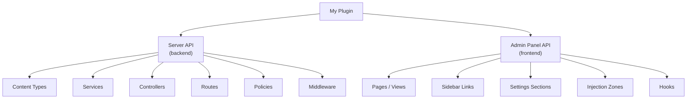

# Plugin Development

Plugins are Strapi's primary extension mechanism. They bundle backend logic (content types, services, controllers) and
admin UI (React components, sidebar links, settings pages) into reusable packages.

## Plugin architecture



---

## Scaffolding a plugin

Use the CLI generator:

```bash
npx @strapi/sdk-plugin init my-plugin
# or inside an existing Strapi project:
yarn strapi generate
# Select "plugin"
```

This creates the following structure:

```
src/plugins/my-plugin/
├── admin/
│   └── src/
│       ├── index.ts         # Admin entry file
│       ├── pages/           # Admin views
│       └── components/      # Shared components
├── server/
│   └── src/
│       ├── index.ts         # Server entry file
│       ├── content-types/   # Plugin content types
│       ├── controllers/     # Plugin controllers
│       ├── routes/          # Plugin routes
│       ├── services/        # Plugin services
│       └── policies/        # Plugin policies
├── package.json
└── strapi-admin.js          # Admin build entry
```

---

## Server API

### Entry file

```ts
// server/src/index.ts
import contentTypes from './content-types';
import controllers from './controllers';
import routes from './routes';
import services from './services';
import policies from './policies';
import middlewares from './middlewares';

export default {
  register({ strapi }) {
    // Registration logic (runs before bootstrap)
  },
  bootstrap({ strapi }) {
    // Bootstrap logic (runs after all plugins registered)
  },
  destroy({ strapi }) {
    // Cleanup on shutdown
  },
  contentTypes,
  controllers,
  routes,
  services,
  policies,
  middlewares,
};
```

### Content types

```json
// server/src/content-types/bookmark/schema.json
{
  "kind": "collectionType",
  "collectionName": "bookmarks",
  "info": {
    "singularName": "bookmark",
    "pluralName": "bookmarks",
    "displayName": "Bookmark"
  },
  "options": {
    "draftAndPublish": false
  },
  "pluginOptions": {},
  "attributes": {
    "title": {
      "type": "string",
      "required": true
    },
    "url": {
      "type": "string",
      "required": true
    },
    "description": {
      "type": "text"
    },
    "owner": {
      "type": "relation",
      "relation": "manyToOne",
      "target": "plugin::users-permissions.user"
    }
  }
}
```

```ts
// server/src/content-types/index.ts
import bookmarkSchema from './bookmark/schema.json';

export default {
  bookmark: {
    schema: bookmarkSchema,
  },
};
```

### Controllers

```ts
// server/src/controllers/bookmark.ts
import type { Core } from '@strapi/strapi';

const bookmarkController = ({ strapi }: { strapi: Core.Strapi }) => ({
  async find(ctx) {
    const user = ctx.state.user;
    const bookmarks = await strapi
      .plugin('my-plugin')
      .service('bookmark')
      .findByUser(user.id);

    ctx.body = { data: bookmarks };
  },

  async create(ctx) {
    const user = ctx.state.user;
    const { title, url, description } = ctx.request.body;

    const bookmark = await strapi
      .plugin('my-plugin')
      .service('bookmark')
      .create({ title, url, description, owner: user.id });

    ctx.body = { data: bookmark };
  },

  async delete(ctx) {
    const { id } = ctx.params;
    const user = ctx.state.user;

    const deleted = await strapi
      .plugin('my-plugin')
      .service('bookmark')
      .deleteIfOwner(id, user.id);

    if (!deleted) {
      return ctx.forbidden('You can only delete your own bookmarks');
    }

    ctx.body = { data: deleted };
  },
});

export default bookmarkController;
```

### Services

```ts
// server/src/services/bookmark.ts
import type { Core } from '@strapi/strapi';

const bookmarkService = ({ strapi }: { strapi: Core.Strapi }) => ({
  async findByUser(userId: string) {
    return strapi.documents('plugin::my-plugin.bookmark').findMany({
      filters: { owner: { id: userId } },
      sort: { createdAt: 'desc' },
    });
  },

  async create(data: { title: string; url: string; description?: string; owner: string }) {
    return strapi.documents('plugin::my-plugin.bookmark').create({
      data,
    });
  },

  async deleteIfOwner(bookmarkId: string, userId: string) {
    const bookmark = await strapi.documents('plugin::my-plugin.bookmark').findOne(bookmarkId, {
      populate: ['owner'],
    });

    if (!bookmark || bookmark.owner?.id !== userId) {
      return null;
    }

    return strapi.documents('plugin::my-plugin.bookmark').delete(bookmarkId);
  },
});

export default bookmarkService;
```

### Routes

```ts
// server/src/routes/index.ts
export default [
  {
    method: 'GET',
    path: '/bookmarks',
    handler: 'bookmark.find',
    config: {
      policies: [],
    },
  },
  {
    method: 'POST',
    path: '/bookmarks',
    handler: 'bookmark.create',
    config: {
      policies: [],
    },
  },
  {
    method: 'DELETE',
    path: '/bookmarks/:id',
    handler: 'bookmark.delete',
    config: {
      policies: [],
    },
  },
];
```

Plugin routes are prefixed with `/my-plugin/`, so the endpoints become `/my-plugin/bookmarks`.

---

## Admin Panel API

### Entry file

```ts
// admin/src/index.ts
import { prefixPluginTranslations } from '@strapi/helper-plugin';
import pluginId from './pluginId';
import BookmarkIcon from './components/BookmarkIcon';

export default {
  register(app) {
    // Add a sidebar link
    app.addMenuLink({
      to: `/plugins/${pluginId}`,
      icon: BookmarkIcon,
      intlLabel: {
        id: `${pluginId}.plugin.name`,
        defaultMessage: 'Bookmarks',
      },
      Component: async () => {
        const component = await import('./pages/App');
        return component;
      },
      permissions: [],
    });

    // Register the plugin
    app.registerPlugin({
      id: pluginId,
      name: 'Bookmarks',
    });
  },

  bootstrap(app) {
    // Add settings link
    app.addSettingsLink('global', {
      intlLabel: {
        id: `${pluginId}.settings.title`,
        defaultMessage: 'Bookmark Settings',
      },
      id: `${pluginId}-settings`,
      to: `/settings/${pluginId}`,
      Component: async () => {
        const component = await import('./pages/Settings');
        return component;
      },
      permissions: [],
    });
  },

  async registerTrads({ locales }) {
    const importedTrads = await Promise.all(
      locales.map((locale) => {
        return import(`./translations/${locale}.json`)
          .then(({ default: data }) => ({
            data: prefixPluginTranslations(data, pluginId),
            locale,
          }))
          .catch(() => ({ data: {}, locale }));
      })
    );
    return importedTrads;
  },
};
```

### Plugin page component

```tsx
// admin/src/pages/App.tsx
import React, { useEffect, useState } from 'react';
import { Box, Typography, Table, Thead, Tbody, Tr, Th, Td, Button } from '@strapi/design-system';
import { useFetchClient } from '@strapi/helper-plugin';
import pluginId from '../pluginId';

const App = () => {
  const { get, del } = useFetchClient();
  const [bookmarks, setBookmarks] = useState([]);
  const [loading, setLoading] = useState(true);

  useEffect(() => {
    const fetchBookmarks = async () => {
      try {
        const { data } = await get(`/${pluginId}/bookmarks`);
        setBookmarks(data.data || []);
      } catch (error) {
        console.error('Failed to fetch bookmarks:', error);
      } finally {
        setLoading(false);
      }
    };
    fetchBookmarks();
  }, []);

  const handleDelete = async (id: string) => {
    try {
      await del(`/${pluginId}/bookmarks/${id}`);
      setBookmarks((prev) => prev.filter((b) => b.id !== id));
    } catch (error) {
      console.error('Delete failed:', error);
    }
  };

  if (loading) return <Typography>Loading...</Typography>;

  return (
    <Box padding={8}>
      <Typography variant="alpha">My Bookmarks</Typography>
      <Table colCount={4} rowCount={bookmarks.length}>
        <Thead>
          <Tr>
            <Th><Typography variant="sigma">Title</Typography></Th>
            <Th><Typography variant="sigma">URL</Typography></Th>
            <Th><Typography variant="sigma">Created</Typography></Th>
            <Th><Typography variant="sigma">Actions</Typography></Th>
          </Tr>
        </Thead>
        <Tbody>
          {bookmarks.map((bookmark) => (
            <Tr key={bookmark.id}>
              <Td><Typography>{bookmark.title}</Typography></Td>
              <Td><a href={bookmark.url} target="_blank" rel="noopener noreferrer">{bookmark.url}</a></Td>
              <Td><Typography>{new Date(bookmark.createdAt).toLocaleDateString()}</Typography></Td>
              <Td>
                <Button variant="danger-light" onClick={() => handleDelete(bookmark.id)}>
                  Delete
                </Button>
              </Td>
            </Tr>
          ))}
        </Tbody>
      </Table>
    </Box>
  );
};

export default App;
```

---

## Plugin configuration

Allow users to configure your plugin:

```ts
// server/src/index.ts
export default {
  register({ strapi }) {
    // Access plugin config
    const config = strapi.config.get('plugin.my-plugin');
    strapi.log.info(`Plugin configured with: ${JSON.stringify(config)}`);
  },
};
```

Users configure it in their project:

```js
// config/plugins.js
module.exports = {
  'my-plugin': {
    enabled: true,
    config: {
      maxBookmarksPerUser: 100,
      enablePublicBookmarks: false,
    },
  },
};
```

Access config in services:

```ts
async create(data) {
  const config = strapi.config.get('plugin.my-plugin');
  const userBookmarks = await this.findByUser(data.owner);

  if (userBookmarks.length >= config.maxBookmarksPerUser) {
    throw new Error('Bookmark limit reached');
  }

  return strapi.documents('plugin::my-plugin.bookmark').create({ data });
},
```

---

## Plugin lifecycle

| Phase         | Method        | Use case                                                                    |
|---------------|---------------|-----------------------------------------------------------------------------|
| **Register**  | `register()`  | Register Document Service middleware, extend GraphQL schema, add middleware |
| **Bootstrap** | `bootstrap()` | Seed data, set up cron jobs, register event listeners                       |
| **Destroy**   | `destroy()`   | Clean up connections, stop timers                                           |

```ts
export default {
  register({ strapi }) {
    // Extend the Document Service
    strapi.documents.use(async (context, next) => {
      if (context.uid === 'plugin::my-plugin.bookmark') {
        // Custom logic for bookmark operations
      }
      return next();
    });
  },

  bootstrap({ strapi }) {
    // Seed default bookmarks for new users
    strapi.db.lifecycles.subscribe({
      models: ['plugin::users-permissions.user'],
      async afterCreate(event) {
        const { result } = event;
        await strapi.documents('plugin::my-plugin.bookmark').create({
          data: {
            title: 'Getting Started',
            url: 'https://docs.strapi.io',
            owner: result.id,
          },
        });
      },
    });
  },

  destroy({ strapi }) {
    strapi.log.info('My plugin shutting down');
  },
};
```

---

## Publishing to npm

1. **Update `package.json`**:

```json
{
  "name": "strapi-plugin-bookmarks",
  "version": "1.0.0",
  "description": "Bookmark management for Strapi",
  "strapi": {
    "name": "bookmarks",
    "displayName": "Bookmarks",
    "description": "Save and manage bookmarks",
    "kind": "plugin"
  },
  "main": "server/src/index.ts",
  "keywords": ["strapi", "plugin", "bookmarks"],
  "license": "MIT"
}
```

2. **Build the admin**:

```bash
yarn build
```

3. **Publish**:

```bash
npm publish
```

4. **Users install it**:

```bash
npm install strapi-plugin-bookmarks
```

---

## Common pitfalls

| Pitfall                            | Problem                                   | Fix                                              |
|------------------------------------|-------------------------------------------|--------------------------------------------------|
| Forgetting to export content types | Strapi doesn't create the database tables | Export from `server/src/content-types/index.ts`  |
| Plugin routes not working          | 404 on all plugin endpoints               | Routes are auto-prefixed with the plugin name    |
| Admin page not loading             | Blank page in admin                       | Ensure `register()` calls `app.registerPlugin()` |
| Missing translations               | UI shows translation keys                 | Export `registerTrads` with locale files         |
| Accessing wrong service            | `strapi.service()` returns undefined      | Use `strapi.plugin('name').service('name')`      |

---

## See also

- [Custom Controllers and Services](custom-controllers-services.md) -- the patterns plugins use internally
- [Admin Panel Customization](admin-panel-customization.md) -- extending the admin without a full plugin
- [Middleware and Policies](middleware-and-policies.md) -- adding middleware from plugins
- [Lifecycle Hooks](lifecycle-hooks.md) -- plugin lifecycle events
