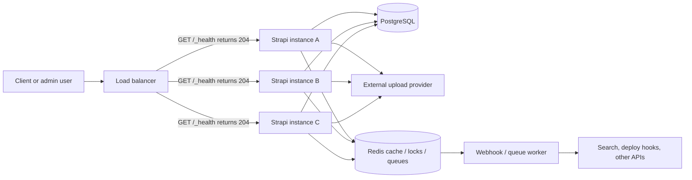

# Running Strapi on Multiple Instances

Running more than one Strapi instance is mostly an infrastructure exercise: keep each Node.js process disposable, move
shared state out of the local filesystem and process memory, and make any background side effect safe to run once.



## What can be stateless?

A Strapi instance can be treated as stateless when every instance runs the same release artifact and uses the same
configuration for shared dependencies:

- **Application code and admin build**: build once and deploy the same image or artifact to every instance.
- **HTTP API requests**: any request can hit any instance when sessions, JWT secrets, upload storage, and caches are
  shared correctly.
- **Admin panel assets**: each instance can serve the same admin build, or the admin panel can be hosted separately.

The stateful parts must be shared or coordinated:

| State | Multi-instance requirement |
|---|---|
| Database | Use one shared production database, normally PostgreSQL. |
| Uploads | Use an external upload provider such as S3, Cloudinary, or another shared provider. Do not rely on local `public/uploads` in production. |
| Secrets | Use identical `APP_KEYS`, `ADMIN_JWT_SECRET`, `JWT_SECRET`, API token salts, and transfer token salts on every instance. |
| Sessions and tokens | Use the same signing/encryption secrets everywhere so cookies and JWTs remain valid after load-balancer hops. |
| Cron jobs | Coordinate execution, because every instance with cron enabled runs the configured tasks. |
| Caches | Avoid process-local truth. Use Redis, a CDN, or explicit invalidation fan-out. |
| Queues and integrations | Use durable queues or outbox rows when delivery matters. |

A typical secret configuration looks like this:

```js
// config/server.js
module.exports = ({ env }) => ({
  app: {
    keys: env.array('APP_KEYS'),
  },
});
```

```js
// config/admin.js
module.exports = ({ env }) => ({
  auth: {
    secret: env('ADMIN_JWT_SECRET'),
  },
  apiToken: {
    salt: env('API_TOKEN_SALT'),
  },
  transfer: {
    token: {
      salt: env('TRANSFER_TOKEN_SALT'),
    },
  },
});
```

Keep the Users & Permissions `JWT_SECRET` identical as well if your project uses API authentication tokens.

## Uploads must not be local

The default local upload provider writes to `public/uploads` on the instance filesystem. That breaks in multi-instance
production because instance A can upload a file that instance B cannot read, and container redeploys can erase local
disks.

Use an external upload provider and point all instances to the same bucket/account:

```js
// config/plugins.js
module.exports = ({ env }) => ({
  upload: {
    config: {
      provider: 'aws-s3',
      providerOptions: {
        s3Options: {
          credentials: {
            accessKeyId: env('AWS_ACCESS_KEY_ID'),
            secretAccessKey: env('AWS_ACCESS_SECRET'),
          },
          region: env('AWS_REGION'),
          params: {
            Bucket: env('AWS_BUCKET'),
          },
        },
      },
    },
  },
});
```

## Load balancer and trusted proxies

Use Strapi's built-in liveness endpoint for basic load-balancer checks:

```bash
curl -i https://cms.example.com/_health
```

`GET /_health` returns `204 No Content` when the HTTP server is alive. Treat it as a liveness check, not a full readiness
check: it does not prove the database, Redis, or upload provider are healthy.

When Strapi runs behind a reverse proxy or load balancer, configure the public URL and trust the proxy headers that your
infrastructure controls:

```js
// config/server.js
module.exports = ({ env }) => ({
  host: env('HOST', '0.0.0.0'),
  port: env.int('PORT', 1337),
  url: env('PUBLIC_URL', 'https://cms.example.com'),
  proxy: {
    koa: true,
    ipHeader: 'X-Forwarded-For',
    maxIpsCount: env.int('TRUSTED_PROXY_HOPS', 1),
  },
});
```

Only enable trusted proxy behavior when your load balancer strips or controls incoming `X-Forwarded-*` headers.

## Cron jobs need locking

Strapi cron tasks are process-local. If three instances boot with cron enabled, all three load `config/cron-tasks` and
all three run the same scheduled task. That is fine for harmless polling, but dangerous for publishing, sending email,
or syncing external systems.

### Option 1: enable cron on one instance

This is the simplest operational model. Run one dedicated cron instance or set an environment variable on exactly one
replica:

```js
// config/server.js
const cronTasks = require('./cron-tasks');

module.exports = ({ env }) => ({
  cron: {
    enabled: env.bool('CRON_ENABLED', false),
    tasks: cronTasks,
  },
});
```

Set `CRON_ENABLED=true` only on the cron runner. Leave it `false` on regular web replicas.

### Option 2: PostgreSQL advisory lock

This example is for PostgreSQL only. It uses Knex through `strapi.db.connection` and keeps lock/unlock on the same DB
connection by running through a transaction.

```js
// config/cron-tasks.js
const LOCK_ID = 47001;

async function withPgAdvisoryLock(strapi, work) {
  await strapi.db.connection.transaction(async (trx) => {
    const lockResult = await trx.raw(
      'SELECT pg_try_advisory_lock(?) AS locked',
      [LOCK_ID]
    );
    const locked = lockResult.rows?.[0]?.locked === true;

    if (!locked) {
      strapi.log.debug('[cron] Another instance owns the advisory lock');
      return;
    }

    try {
      await work();
    } finally {
      await trx.raw('SELECT pg_advisory_unlock(?)', [LOCK_ID]);
    }
  });
}

module.exports = {
  scheduledPublishing: {
    task: async ({ strapi }) => {
      await withPgAdvisoryLock(strapi, async () => {
        await strapi.service('api::scheduler.scheduler').runAll();
      });
    },
    options: {
      rule: '*/5 * * * *',
      tz: 'UTC',
    },
  },
};
```

For long jobs, choose a unique lock ID per job and keep the critical section small.

### Option 3: Redis `SET NX PX` lock

This example uses `ioredis`, which exists on npm and is already a common Strapi cache client choice. It is a simple
single-Redis-node lock. For stricter distributed locking semantics, use a reviewed lock library and understand its
failure model.

```js
// src/utils/redis-lock.js
const Redis = require('ioredis');
const redis = new Redis(process.env.REDIS_URL);

const releaseScript = `
if redis.call('get', KEYS[1]) == ARGV[1] then
  return redis.call('del', KEYS[1])
else
  return 0
end
`;

async function withRedisLock(key, ttlMs, work) {
  const token = `${process.pid}:${Date.now()}:${Math.random()}`;
  const acquired = await redis.set(key, token, 'NX', 'PX', ttlMs);

  if (acquired !== 'OK') {
    return false;
  }

  try {
    await work();
    return true;
  } finally {
    await redis.eval(releaseScript, 1, key, token);
  }
}

module.exports = { withRedisLock };
```

```js
// config/cron-tasks.js
const { withRedisLock } = require('../src/utils/redis-lock');

module.exports = {
  scheduledPublishing: {
    task: async ({ strapi }) => {
      await withRedisLock('locks:cron:scheduled-publishing', 60000, async () => {
        await strapi.service('api::scheduler.scheduler').runAll();
      });
    },
    options: {
      rule: '*/5 * * * *',
      tz: 'UTC',
    },
  },
};
```

## Webhook reliability

Strapi's built-in webhooks are convenient for best-effort HTTP delivery from Strapi events. Do not treat them as a
durable delivery system unless you have verified retry, backoff, and dead-letter behavior for the exact Strapi version
you run. The public configuration does not expose a durable retry queue.

For critical integrations, use an outbox or queue pattern:

1. Document Service middleware records an event row in the database or pushes a job to a queue such as BullMQ.
2. A worker delivers the webhook with retries, exponential backoff, and a dead-letter state.
3. Every event gets an idempotency key.
4. The receiver stores processed keys and ignores duplicates.

BullMQ exists on npm and uses Redis for durable job processing. A database outbox is also fine when you want the event to
commit in the same transaction boundary as your content write.

The example below assumes you created an `integration-event` collection type (fields `eventId`, `action`, `uid`,
`documentId`, `payload` as JSON, `status`) with Draft & Publish disabled, and a separate worker that polls pending rows.

```js
// src/index.js
module.exports = {
  register({ strapi }) {
    strapi.documents.use(async (context, next) => {
      const result = await next();

      if (!['create', 'update', 'delete', 'publish', 'unpublish'].includes(context.action)) {
        return result;
      }

      await strapi.db.query('api::integration-event.integration-event').create({
        data: {
          eventId: `${context.action}:${context.uid}:${result?.documentId}:${result?.updatedAt || Date.now()}`,
          action: context.action,
          uid: context.uid,
          documentId: result?.documentId,
          payload: result,
          status: 'pending',
        },
      });

      return result;
    });
  },
};
```

If you use built-in webhook payloads directly, Strapi does not provide a globally unique delivery ID in the common entry
payload shape. Derive a receiver-side idempotency key from stable fields such as `event`, `uid` or `model`,
`documentId`, and `updatedAt` or `publishedAt`, or add your own event ID in the outbox payload.

## Cache invalidation across instances

Process-local memory caches diverge as soon as you have more than one instance. If instance A invalidates its `Map`,
instance B can still serve stale data.

Use one of these patterns instead:

- **Shared Redis cache**: every instance reads and writes the same keys.
- **Redis pub/sub invalidation**: each instance may keep a small local cache, but subscribes to invalidation messages.
- **Key versioning**: include a Redis-backed version number in cache keys and increment the version on writes.
- **CDN purge or surrogate keys**: for public API or media responses fronted by a CDN.

Document Service middleware is the right place to publish invalidations for content changes:

```js
// src/index.js
const Redis = require('ioredis');
const redis = new Redis(process.env.REDIS_URL);

module.exports = {
  register({ strapi }) {
    strapi.documents.use(async (context, next) => {
      const result = await next();

      if (['create', 'update', 'delete', 'publish', 'unpublish'].includes(context.action)) {
        await redis.publish('strapi:cache:invalidate', JSON.stringify({
          uid: context.uid,
          action: context.action,
          documentId: result?.documentId || context.params?.documentId,
        }));
      }

      return result;
    });
  },
};
```

Subscribers can clear local keys, delete Redis keys by prefix, or increment a content-type version key.

## Database connection pool sizing

Every Strapi instance owns its own database pool. The safe pool size is a cluster-level calculation, not an instance-only
calculation:

```text
(instance count * pool.max) + workers + migration jobs + admin tools <= postgres max_connections - reserve
```

Example: with 8 Strapi instances, 2 background workers, and PostgreSQL `max_connections = 100`, reserve at least 20
connections for maintenance and failover. That leaves 80 application connections, so `pool.max` should be no more than 9
or 10 per web instance, and lower if workers use large pools.

```js
// config/database.js
module.exports = ({ env }) => ({
  connection: {
    client: 'postgres',
    connection: {
      host: env('DATABASE_HOST'),
      port: env.int('DATABASE_PORT', 5432),
      database: env('DATABASE_NAME'),
      user: env('DATABASE_USERNAME'),
      password: env('DATABASE_PASSWORD'),
    },
    pool: {
      min: env.int('DATABASE_POOL_MIN', 0),
      max: env.int('DATABASE_POOL_MAX', 8),
    },
  },
});
```

Use a pooler such as PgBouncer only after checking compatibility with your transaction and advisory-lock patterns.

## Migrations and rolling deploys

Strapi 5 runs `database/migrations` automatically on application startup before schema sync, tracks applied migration
files, and supports `up(knex)` migrations. The official migration docs describe transaction execution and migration
tracking, but they are not a replacement for a deliberate multi-instance release plan.

For production clusters, use one of these safer approaches:

1. Run a single release job or one temporary Strapi instance to execute pending migrations.
2. Stop or keep web instances on the old release until migrations finish.
3. Start the new web instances after the release job succeeds.
4. Keep schema changes backward compatible during rolling deploys.

Use an expand-and-contract sequence for risky changes:

| Phase | Example |
|---|---|
| Expand | Add nullable columns, new content types, or new indexes first. |
| Migrate | Backfill or transform data in a migration or one-off worker. |
| Switch | Deploy code that reads the new shape while still tolerating the old one. |
| Contract | Remove old fields only after every instance and integration has switched. |

Avoid a rolling deploy where old and new Strapi instances boot at the same time while content-type schemas disagree.
Schema sync can add, alter, or remove database objects based on the current content-type definitions.

## Admin panel deployment

The simplest setup is to let every Strapi instance serve the same admin panel build at `/admin`. That works when every
instance runs the same artifact and the load balancer routes admin traffic to the same cluster.

If the admin panel is served separately, disable serving it from Strapi and configure the admin URL in `config/admin.js`:

```js
// config/admin.js
module.exports = ({ env }) => ({
  url: env('ADMIN_URL', 'https://admin.example.com'),
  serveAdminPanel: env.bool('SERVE_ADMIN_PANEL', false),
});
```

Build and deploy the admin panel from the same release as the API so plugin UI code and API behavior stay compatible.

## Multi-instance checklist

| Area | Check |
|---|---|
| Release artifact | All instances run the same code, dependencies, and admin build. |
| Uploads | External upload provider configured; no production reliance on `public/uploads`. |
| Secrets | `APP_KEYS`, `ADMIN_JWT_SECRET`, `JWT_SECRET`, salts, and transfer secrets match everywhere. |
| Load balancer | `/_health` liveness check configured and trusted proxy settings reviewed. |
| Cron | Exactly one cron runner or distributed locks for every side-effecting job. |
| Webhooks | Critical integrations use an outbox or queue with retries and idempotency keys. |
| Cache | In-memory caches avoided or invalidated through Redis pub/sub or key versioning. |
| Database pools | Total pool connections across instances fit under PostgreSQL `max_connections`. |
| Migrations | A single release step runs migrations before the scaled web deployment. |
| Rolling deploys | Schema changes are backward compatible until all instances are on the new release. |
| Admin panel | Served consistently by each instance or separately with `serveAdminPanel: false`. |
