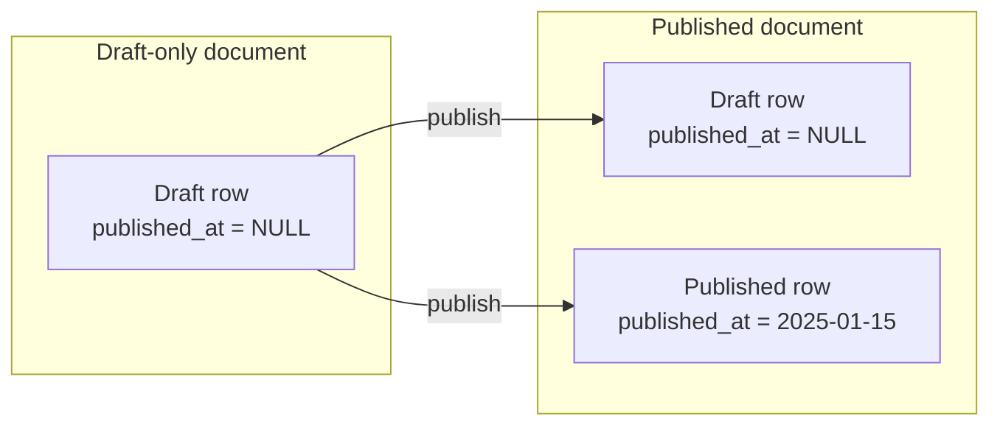

# Scheduled Publishing

Strapi does not ship with built-in scheduled publishing. This page shows how to implement it reliably, explains the
draft/published duality that makes naive approaches fail, and covers advanced patterns like scheduled unpublishing,
editorial review, and timezone handling.

## The problem: draft/published duality

In Strapi 5, every document can have **two versions simultaneously**: a draft and a published version. When you publish
a document, the draft row remains in the database as a shadow copy.



This means:

```js
// Returns ALL drafts, including shadow drafts of published documents
const drafts = await strapi.documents('api::article.article').findMany({
  status: 'draft',
});
// ^ This includes articles that are ALREADY published!
```

You **cannot** use `status: 'draft'` alone to find "unpublished" documents. Every published document also has a draft.

---

## Solution: dedicated `scheduledPublishAt` field

Instead of relying on publish status, use a **dedicated datetime field** as the single source of truth:

- If `scheduledPublishAt` is set and in the past -> publish the document
- After publishing -> clear the field
- The field being `null` means "no scheduled publish pending"

This completely sidesteps the draft duality issue.

### Step 1: add the field to your content type

In the Content-Type Builder, add a `scheduledPublishAt` field of type **DateTime** to every content type that needs
scheduling. Or add it directly in the schema:

```json
// src/api/article/content-types/article/schema.json
{
  "attributes": {
    "title": { "type": "string", "required": true },
    "content": { "type": "richtext" },
    "scheduledPublishAt": {
      "type": "datetime"
    }
  }
}
```

### Step 2: create the cron job

```js
// config/server.js
module.exports = ({ env }) => ({
  host: env('HOST', '0.0.0.0'),
  port: env.int('PORT', 1337),
  cron: {
    enabled: true,
    tasks: {
      // ┌──── minute (0-59)
      // │ ┌── hour (0-23)
      // │ │ ┌ day of month (1-31)
      // │ │ │ ┌ month (1-12)
      // │ │ │ │ ┌ day of week (0-7, 0 and 7 = Sunday)
      // │ │ │ │ │
      // * * * * *
      '*/5 * * * *': async ({ strapi }) => {
        await publishScheduled(strapi);
      },
    },
  },
});

async function publishScheduled(strapi) {
  const now = new Date().toISOString();

  // All content types that support scheduled publishing
  const schedulableTypes = [
    'api::article.article',
    'api::page.page',
    // add more as needed
  ];

  for (const uid of schedulableTypes) {
    const documents = await strapi.documents(uid).findMany({
      status: 'draft',
      filters: {
        scheduledPublishAt: {
          $lte: now,
          $notNull: true,
        },
      },
      fields: ['title', 'scheduledPublishAt'],
    });

    for (const doc of documents) {
      try {
        // Publish the document
        await strapi.documents(uid).publish(doc.documentId);

        // Clear the scheduled date so it won't be picked up again
        await strapi.documents(uid).update(doc.documentId, {
          data: { scheduledPublishAt: null },
        });

        strapi.log.info(
          `[scheduled-publish] Published ${uid} "${doc.title || doc.documentId}"`
        );
      } catch (error) {
        strapi.log.error(
          `[scheduled-publish] Failed to publish ${uid} ${doc.documentId}:`,
          error
        );
      }
    }
  }
}
```

### Why this works for all scenarios

| Scenario                                      | What happens                                                     |
|-----------------------------------------------|------------------------------------------------------------------|
| New draft, never published                    | `publish()` creates the published version. Correct.              |
| Already published, editor schedules an update | `publish()` re-publishes with the latest draft content. Correct. |
| Published, no `scheduledPublishAt` set        | Not picked up by the filter. Correct.                            |
| Already processed by cron                     | `scheduledPublishAt` was cleared. Not picked up again. Correct.  |

---

## Scheduled unpublishing

The same pattern works for scheduled unpublishing (e.g., time-limited promotions):

```json
// Add to schema.json
{
  "attributes": {
    "scheduledPublishAt": { "type": "datetime" },
    "scheduledUnpublishAt": { "type": "datetime" }
  }
}
```

```js
// config/server.js -- extend the cron task
'*/5 * * * *': async ({ strapi }) => {
  await publishScheduled(strapi);
  await unpublishScheduled(strapi);
},

async function unpublishScheduled(strapi) {
  const now = new Date().toISOString();

  const schedulableTypes = [
    'api::article.article',
    'api::page.page',
  ];

  for (const uid of schedulableTypes) {
    // For unpublishing, we query the PUBLISHED status
    const documents = await strapi.documents(uid).findMany({
      status: 'published',
      filters: {
        scheduledUnpublishAt: {
          $lte: now,
          $notNull: true,
        },
      },
      fields: ['title', 'scheduledUnpublishAt'],
    });

    for (const doc of documents) {
      try {
        await strapi.documents(uid).unpublish(doc.documentId);
        await strapi.documents(uid).update(doc.documentId, {
          data: { scheduledUnpublishAt: null },
        });

        strapi.log.info(
          `[scheduled-unpublish] Unpublished ${uid} "${doc.title || doc.documentId}"`
        );
      } catch (error) {
        strapi.log.error(
          `[scheduled-unpublish] Failed to unpublish ${uid} ${doc.documentId}:`,
          error
        );
      }
    }
  }
}
```

---

## Extracting into a reusable service

For cleaner code, move the scheduling logic into a dedicated service:

```js
// src/api/scheduler/services/scheduler.js
module.exports = ({ strapi }) => ({

  schedulableTypes: [
    'api::article.article',
    'api::page.page',
  ],

  async processScheduledPublish() {
    const now = new Date().toISOString();
    let totalPublished = 0;

    for (const uid of this.schedulableTypes) {
      const documents = await strapi.documents(uid).findMany({
        status: 'draft',
        filters: {
          scheduledPublishAt: { $lte: now, $notNull: true },
        },
        fields: ['title', 'scheduledPublishAt'],
      });

      for (const doc of documents) {
        try {
          await strapi.documents(uid).publish(doc.documentId);
          await strapi.documents(uid).update(doc.documentId, {
            data: { scheduledPublishAt: null },
          });
          totalPublished++;
          strapi.log.info(`[scheduler] Published ${uid} "${doc.title}"`);
        } catch (error) {
          strapi.log.error(`[scheduler] Publish failed: ${uid} ${doc.documentId}`, error);
        }
      }
    }

    return totalPublished;
  },

  async processScheduledUnpublish() {
    const now = new Date().toISOString();
    let totalUnpublished = 0;

    for (const uid of this.schedulableTypes) {
      const documents = await strapi.documents(uid).findMany({
        status: 'published',
        filters: {
          scheduledUnpublishAt: { $lte: now, $notNull: true },
        },
        fields: ['title', 'scheduledUnpublishAt'],
      });

      for (const doc of documents) {
        try {
          await strapi.documents(uid).unpublish(doc.documentId);
          await strapi.documents(uid).update(doc.documentId, {
            data: { scheduledUnpublishAt: null },
          });
          totalUnpublished++;
          strapi.log.info(`[scheduler] Unpublished ${uid} "${doc.title}"`);
        } catch (error) {
          strapi.log.error(`[scheduler] Unpublish failed: ${uid} ${doc.documentId}`, error);
        }
      }
    }

    return totalUnpublished;
  },

  async runAll() {
    const published = await this.processScheduledPublish();
    const unpublished = await this.processScheduledUnpublish();
    return { published, unpublished };
  },
});
```

The cron job becomes a one-liner:

```js
// config/server.js
'*/5 * * * *': async ({ strapi }) => {
  await strapi.service('api::scheduler.scheduler').runAll();
},
```

---

## Preventing manual publish of scheduled content

Editors might accidentally click "Publish" on a document that's scheduled for the future. Guard against this with a
Document Service middleware:

```js
// src/index.js
module.exports = {
  register({ strapi }) {
    strapi.documents.use(async (context, next) => {
      if (context.action !== 'publish') {
        return next();
      }

      const docId = context.params.documentId;
      const uid = context.uid;

      // Check if this document has a future scheduled date
      const draft = await strapi.documents(uid).findOne(docId, {
        status: 'draft',
        fields: ['scheduledPublishAt'],
      });

      if (draft?.scheduledPublishAt) {
        const scheduledDate = new Date(draft.scheduledPublishAt);

        if (scheduledDate > new Date()) {
          throw new Error(
            `This document is scheduled for publication at ${scheduledDate.toISOString()}. ` +
            `Remove the scheduled date first to publish manually.`
          );
        }
      }

      return next();
    });
  },
};
```

---

## Optional: expose a manual trigger endpoint

Useful for testing or for external systems (CI/CD, webhooks) to trigger scheduled publishing on demand:

```js
// src/api/scheduler/routes/scheduler.js
module.exports = {
  routes: [
    {
      method: 'POST',
      path: '/scheduler/run',
      handler: 'api::scheduler.scheduler.trigger',
      config: {
        policies: [
          {
            name: 'global::has-role',
            config: { roles: ['admin'] },
          },
        ],
      },
    },
    {
      method: 'GET',
      path: '/scheduler/pending',
      handler: 'api::scheduler.scheduler.pending',
      config: {
        policies: [
          {
            name: 'global::has-role',
            config: { roles: ['admin', 'editor'] },
          },
        ],
      },
    },
  ],
};
```

```js
// src/api/scheduler/controllers/scheduler.js
module.exports = {
  async trigger(ctx) {
    const result = await strapi.service('api::scheduler.scheduler').runAll();
    ctx.body = {
      message: `Published ${result.published}, unpublished ${result.unpublished}`,
      ...result,
    };
  },

  async pending(ctx) {
    const now = new Date().toISOString();
    const types = strapi.service('api::scheduler.scheduler').schedulableTypes;
    const pending = {};

    for (const uid of types) {
      const toPublish = await strapi.documents(uid).findMany({
        status: 'draft',
        filters: {
          scheduledPublishAt: { $notNull: true },
        },
        fields: ['title', 'scheduledPublishAt'],
      });

      const toUnpublish = await strapi.documents(uid).findMany({
        status: 'published',
        filters: {
          scheduledUnpublishAt: { $notNull: true },
        },
        fields: ['title', 'scheduledUnpublishAt'],
      });

      if (toPublish.length || toUnpublish.length) {
        pending[uid] = {
          pendingPublish: toPublish.map(d => ({
            documentId: d.documentId,
            title: d.title,
            scheduledPublishAt: d.scheduledPublishAt,
            overdue: new Date(d.scheduledPublishAt) <= new Date(now),
          })),
          pendingUnpublish: toUnpublish.map(d => ({
            documentId: d.documentId,
            title: d.title,
            scheduledUnpublishAt: d.scheduledUnpublishAt,
            overdue: new Date(d.scheduledUnpublishAt) <= new Date(now),
          })),
        };
      }
    }

    ctx.body = { data: pending };
  },
};
```

---

## Timezone handling

Strapi stores all dates in UTC. If your editors work in different timezones, make sure the frontend converts local time
to UTC before sending it to the API:

```js
// Frontend: convert local datetime input to UTC ISO string
const localDate = new Date('2025-03-15T09:00:00'); // user's local time
const utcString = localDate.toISOString();          // '2025-03-15T08:00:00.000Z' (CET -> UTC)

await fetch('/api/articles/abc123', {
  method: 'PUT',
  headers: {
    'Content-Type': 'application/json',
    Authorization: `Bearer ${jwt}`,
  },
  body: JSON.stringify({
    data: { scheduledPublishAt: utcString },
  }),
});
```

The cron job compares against `new Date().toISOString()` which is always UTC, so no conversion is needed on the server
side.

---

## Notification on scheduled publish

Send an email or webhook when a document is auto-published:

```js
// Extend the service
async processScheduledPublish() {
  // ... (find and publish logic as above)

  for (const doc of documents) {
    try {
      await strapi.documents(uid).publish(doc.documentId);
      await strapi.documents(uid).update(doc.documentId, {
        data: { scheduledPublishAt: null },
      });

      // Notify via email
      const fullDoc = await strapi.documents(uid).findOne(doc.documentId, {
        status: 'published',
        populate: ['createdBy'],
      });

      if (fullDoc?.createdBy?.email) {
        await strapi.plugins['email'].services.email.send({
          to: fullDoc.createdBy.email,
          subject: `Published: ${doc.title}`,
          html: `<p>Your scheduled content <strong>${doc.title}</strong> has been published.</p>`,
        });
      }

      // Notify via webhook
      if (process.env.PUBLISH_WEBHOOK_URL) {
        await fetch(process.env.PUBLISH_WEBHOOK_URL, {
          method: 'POST',
          headers: { 'Content-Type': 'application/json' },
          body: JSON.stringify({
            event: 'scheduled.publish',
            contentType: uid,
            documentId: doc.documentId,
            title: doc.title,
            publishedAt: new Date().toISOString(),
          }),
        });
      }
    } catch (error) {
      strapi.log.error(`[scheduler] Failed: ${uid} ${doc.documentId}`, error);
    }
  }
}
```

---

## Cron interval considerations

| Interval         | Expression     | Use case                                   |
|------------------|----------------|--------------------------------------------|
| Every minute     | `* * * * *`    | Near real-time publishing (higher DB load) |
| Every 5 minutes  | `*/5 * * * *`  | Good default for most projects             |
| Every 15 minutes | `*/15 * * * *` | Low-traffic sites, less DB overhead        |
| Every hour       | `0 * * * *`    | When exact timing doesn't matter           |

Keep in mind that the maximum delay equals the cron interval. A 5-minute cron means content publishes within 5 minutes
of the scheduled time.

---

## Common pitfalls

| Pitfall                                         | Problem                                          | Fix                                                             |
|-------------------------------------------------|--------------------------------------------------|-----------------------------------------------------------------|
| Filtering by `status: 'draft'` alone            | Includes shadow drafts of published documents    | Use `scheduledPublishAt` as the discriminator                   |
| Not clearing `scheduledPublishAt` after publish | Document gets re-processed every cron run        | Always set it to `null` after publishing                        |
| Cron not enabled                                | Jobs never run                                   | Set `cron.enabled: true` in `config/server.js`                  |
| Timezone mismatch                               | Content publishes at the wrong time              | Always store and compare in UTC                                 |
| No error handling in cron                       | One failure stops processing remaining documents | Wrap each publish in try/catch                                  |
| Multiple Strapi instances                       | Same document published by multiple instances    | Use a distributed lock (Redis) or run cron on one instance only |

---

## See also

- [Lifecycle Hooks](lifecycle-hooks.md) -- running logic before/after database operations
- [Custom Controllers and Services](custom-controllers-services.md) -- the service pattern used here
- [Configuration and Deployment](configuration-and-deployment.md) -- cron job setup and server configuration
- [Custom Routes and Endpoints](custom-routes-and-endpoints.md) -- exposing the manual trigger endpoint
