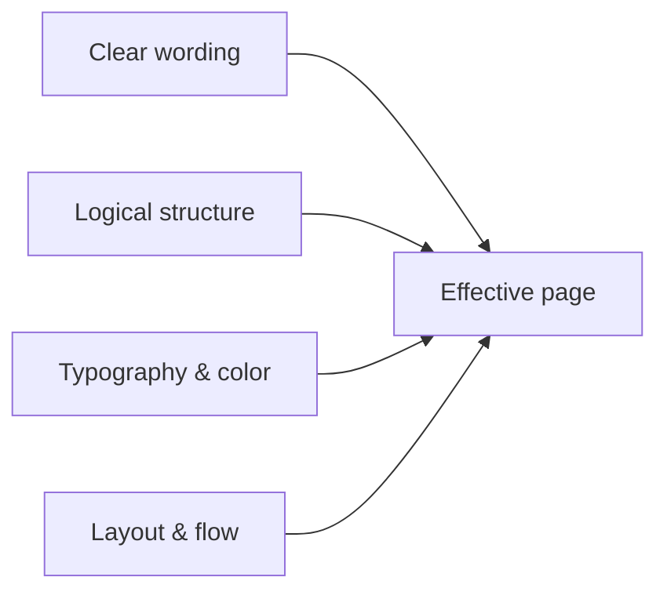

# Website Content and Presentation

This guide is about **what visitors see and read**: wording, layout of ideas, visual emphasis, and color choices that support comprehension. It complements [**Content Modeling**](../content-modeling.md) (schema and CMS structure) and [**Semantic HTML**](../semantic-html.mdx) (meaningful markup). Strong content modeling and markup still fail if paragraphs are dense, calls to action compete with each other, or contrast is too low to read comfortably.

Throughout this page, **Do** blocks show patterns worth copying; **Don't** blocks show common failures (sometimes simplified for clarity).

## Goals for web content

| Goal | What it means in practice |
|------|---------------------------|
| **Scannable** | Headings, lists, and short paragraphs let people orient themselves before reading in depth. |
| **Focused** | Each view has a clear primary purpose; secondary paths stay visible but subordinate. |
| **Consistent** | Patterns for titles, buttons, and terminology repeat across the site so users learn the interface once. |
| **Inclusive** | Color contrast, typography, and structure work for low vision, zoom users, and keyboard navigation -- not only mouse users with ideal monitors. |



---

## Readability

### Language and tone

Plain language is not "dumbing down" -- it reduces **cognitive load** so people can act on what you say. Front-load the meaning: first sentence answers the question; supporting detail follows.

#### Do

```text
Team plans include shared billing and priority support. You can add or remove
seats any time; we prorate the difference on your next invoice.
```

#### Don't

```text
Leveraging our synergistic enterprise-grade paradigm, stakeholders who opt into
the cohort-oriented monetization stream will experience uplift across the
value realization funnel -- consult your success partner for enablement.
```

#### Do (define terms once)

```text
We use single sign-on (SSO) so your team logs in with your company identity
provider (for example Okta or Microsoft Entra ID). After SSO is enabled,
password login stays available as a fallback unless you disable it.
```

#### Don't (unexplained jargon)

```text
Enable IdP-initiated SAML SP flows on the tenant for JIT SCIM provisioning.
```

### Microcopy: buttons, errors, empty states

Microcopy is the **small text** next to controls. It should say what happens next, not celebrate your brand.

#### Do

```text
Button: Save changes
Error: Enter an email address so we can send the receipt.
Empty state: No invoices yet. When you create one, it will appear here.
```

#### Don't

```text
Button: Let's go!
Error: Invalid input
Empty state: Nothing to see here
```

### Typography and measure (CSS)

**Measure** is how long a line of text runs. For Latin scripts, roughly **45--75 characters** per line is a common comfortable range. **Line height** near **1.4--1.6** for body text improves readability on screens. **Root font size** at least **16px** (or `1rem`) for body copy respects user defaults and zoom.

#### Do

```css
:root {
    font-size: 100%; /* respect user browser defaults; 1rem ~= 16px */
}

.prose {
    max-width: 65ch; /* "ch" ~= width of "0" -- line length tied to font */
    line-height: 1.55;
    font-size: 1rem;
}
```

#### Don't

```css
/* Tiny base text and full viewport width make lines hard to track */
body {
    font-size: 12px;
    width: 100vw;
}

article p {
    line-height: 1.05;
}
```

#### Do (responsive type without shrinking body below readable size)

```css
@media (min-width: 768px) {
    .prose {
        font-size: 1.0625rem;
    }
}
```

#### Don't

```css
/* Shrinking primary reading text on mobile */
@media (max-width: 600px) {
    body {
        font-size: 11px;
    }
}
```

---

## Headings, landmarks, and sections

Use **one `<h1>`** per page. Increase heading level **by one** per nesting depth (`h1` → `h2` → `h3`). Headings are **signposts**, not slogans.

#### Do

```html
<main>
    <h1>Pricing</h1>
    <p>Simple plans for teams and individuals.</p>

    <h2>Compare plans</h2>
    <!-- comparison content -->

    <h2>FAQ</h2>
    <h3>Can I change plans later?</h3>
    <p>Yes. Upgrades take effect immediately; downgrades apply next cycle.</p>
</main>
```

#### Don't

```html
<!-- Multiple h1s and skipped levels confuse outline and assistive tech -->
<body>
    <h1>Pricing</h1>
    <h4>Compare plans</h4>
    <h2>FAQ</h2>
    <h1>Contact</h1>
</body>
```

#### Do (heading text describes content)

```html
<h2>Shipping to the EU</h2>
```

#### Don't (vague or purely promotional headings)

```html
<h2>Learn more</h2>
<h2>Discover the future</h2>
```

### Lists versus paragraphs

Use **unordered lists** for parallel options or facts; **ordered lists** for sequences; **paragraphs** when sentences flow as a narrative.

#### Do

```html
<p>Your export includes:</p>
<ul>
    <li>invoice PDFs for the date range you selected</li>
    <li>a CSV of line items</li>
    <li>a manifest JSON file for auditors</li>
</ul>
```

#### Don't (lazy bullets for one sentence)

```html
<ul>
    <li>We offer exports because many customers need them for accounting.</li>
</ul>
```

#### Do (steps)

```html
<ol>
    <li>Open Settings → Billing.</li>
    <li>Click <strong>Download invoices</strong>.</li>
    <li>Choose a date range and confirm.</li>
</ol>
```

---

## Page structure and hierarchy

### One primary job per page

Pick **one outcome** (sign up, compare, contact, read). Reflect that in the **hero**: headline, one or two lines of support, then the **primary action**.

#### Do

```html
<section class="hero" aria-labelledby="hero-title">
    <h1 id="hero-title">Ship invoices faster</h1>
    <p>Create and send compliant invoices in minutes. No card required to try.</p>
    <p>
        <a class="button button--primary" href="/signup/">Start free trial</a>
        <a class="button button--ghost" href="/pricing/">View pricing</a>
    </p>
</section>
```

#### Don't

```html
<!-- Same visual weight on three competing actions -->
<section>
    <h1>Welcome</h1>
    <a class="button" href="/signup/">Sign up</a>
    <a class="button" href="/demo/">Book demo</a>
    <a class="button" href="/whitepaper/">Download PDF</a>
</section>
```

### Progressive disclosure

Put **answers first**; move exceptions, legal text, and rare cases behind **accordions**, **details**, or secondary pages.

#### Do

```html
<section aria-labelledby="returns-heading">
    <h2 id="returns-heading">Returns</h2>
    <p>
        You can return unused items within 30 days for a full refund. Start a
        return from your order history.
    </p>
    <details>
        <summary>Exceptions for opened software and gift cards</summary>
        <p>Opened license keys and gift cards are non-refundable except where
        required by law.</p>
    </details>
</section>
```

#### Don't

```html
<!-- Burying the policy users need inside a long wall of text -->
<p>
    Acme Corp was founded in 1998. Our return policy, which may be updated
    from time to time at our sole discretion, except where prohibited,
    indicates that unless otherwise stated on the product page or in your
    jurisdiction, items may be returned within thirty (30) calendar days...
</p>
```

### Chunking long articles

Prefer **sections with descriptive `h2` headings** over kilometre-long paragraphs. Aim for **2--4 short paragraphs** per section before another heading or list.

#### Do

```html
<h2>Configure webhooks</h2>
<p>
    Webhooks notify your server when events happen -- for example when a
    payment succeeds.
</p>
<p>
    Create an endpoint URL that accepts <code>POST</code> requests and verify
    the signature header on each request.
</p>
<h3>Retry behaviour</h3>
<p>Failed deliveries retry with exponential backoff for up to three days.</p>
```

#### Don't

```html
<p>
    Webhooks notify your server when events happen and you should create an
    endpoint URL that accepts POST requests and verify the signature header
    and if delivery fails we retry with exponential backoff for up to three
    days and you can also filter events in the dashboard and...
</p>
```

---

## Focus and visual hierarchy

### Emphasis in prose

**Bold** highlights a word or phrase in context. **Italics** suit titles or gentle emphasis. Avoid shouting with **all caps** in body copy.

#### Do

```html
<p>
    Click <strong>Save draft</strong> to keep your changes without publishing.
</p>
```

#### Don't

```html
<p>
    Click <strong>Save draft to keep your changes without publishing because
    otherwise you might lose work on this page which would be very bad</strong>.
</p>
```

#### Don't (status by color alone)

```html
<!-- Screen readers and many colour-blind users miss "green means OK" -->
<p><span style="color: #0a0">Published</span></p>
```

#### Do (color plus text or icon with accessible name)

```html
<p>
    <span class="badge badge--success">
        <span class="badge__icon" aria-hidden="true">&#10003;</span>
        Published
    </span>
</p>
```

### Calls to action (CTAs)

**One primary button** per region when you can. Match **label to outcome** ("Delete account" not "Yes"). Secondary actions are visually quieter.

#### Do

```html
<div class="cta-row">
    <button type="button" class="button button--primary">
        Send invitation
    </button>
    <button type="button" class="button button--secondary">
        Cancel
    </button>
</div>
```

```css
.button--primary {
    background: var(--color-action);
    color: var(--color-on-action);
    font-weight: 600;
}

.button--secondary {
    background: transparent;
    color: var(--color-text);
    border: 1px solid var(--color-border);
}
```

#### Don't

```html
<div class="cta-row">
    <button type="button" class="button button--primary">OK</button>
    <button type="button" class="button button--primary">Submit</button>
    <button type="button" class="button button--primary">Continue</button>
</div>
```

### Noise and whitespace

Every **sticky bar**, modal, and sidebar competes with your content. Whitespace **groups** related items and **separates** unrelated blocks.

#### Do

```css
.section {
    padding-block: 3rem;
}

.section + .section {
    border-top: 1px solid var(--color-border-subtle);
}

.stack-tight > * + * {
    margin-top: 0.75rem;
}

.stack-loose > * + * {
    margin-top: 1.5rem;
}
```

#### Don't

```css
/* Packing everything into one box -- headings, ads, and unrelated promos */
.cluster {
    padding: 0.25rem;
    border: 1px solid #ccc;
}

.cluster * {
    margin: 0;
}
```

---

## UX patterns for content

### Links and navigation

**Link text** should make sense out of context (avoid "click here"). Match nav labels to page titles when reasonable.

#### Do

```html
<p>
    Read the full
    <a href="/legal/privacy/">privacy policy</a>
    before you enable analytics cookies.
</p>

<nav aria-label="Breadcrumb">
    <ol>
        <li><a href="/docs/">Documentation</a></li>
        <li><a href="/docs/api/">API</a></li>
        <li aria-current="page">Authentication</li>
    </ol>
</nav>
```

#### Don't

```html
<p>
    For more information about how we handle data,
    <a href="/legal/privacy/">click here</a>.
</p>
```

### Forms

Every control needs a **visible label**. Placeholder text is **not** a label. Associate errors with fields and write **specific** messages.

#### Do

```html
<form>
    <div class="field">
        <label for="email">Work email</label>
        <input
            id="email"
            name="email"
            type="email"
            autocomplete="email"
            required
            aria-describedby="email-hint"
        >
        <p id="email-hint" class="hint">We send receipts and security alerts here.</p>
        <p id="email-error" class="error" hidden><!-- filled when invalid --></p>
    </div>
</form>
```

#### Don't

```html
<!-- Placeholder as only label; error only at top of form -->
<form>
    <p class="form-error">There were errors with your submission.</p>
    <input placeholder="Email address *">
</form>
```

#### Do (inline, actionable error)

```html
<label for="postal">Postal code</label>
<input
    id="postal"
    name="postal"
    type="text"
    inputmode="numeric"
    aria-invalid="true"
    aria-describedby="postal-error"
>
<p id="postal-error" class="error">
    Enter a valid German postcode (five digits).
</p>
```

### Mobile-first content order

Put the **main answer** early in the **DOM** so small screens and assistive tech hit it first -- not only below a huge decorative hero.

#### Do

```html
<main>
    <h1>Opening hours</h1>
    <p>Monday–Friday 9:00–17:00 CET. Closed on public holidays in Berlin.</p>
    <figure class="hero-visual">
        
    </figure>
</main>
```

#### Don't

```html
<!-- Critical facts only after large imagery -->
<main>
    
    <h1>Opening hours</h1>
    <p>Monday–Friday 9:00–17:00...</p>
</main>
```

---

## Color, contrast, and links

Body text must meet **contrast** expectations against its background. WCAG 2.x commonly cites **4.5:1** for normal text and **3:1** for large text (roughly 18px+ regular or 14px+ bold). Interactive components and **focus indicators** also need visible contrast -- see WCAG 2.2.

### Text and UI colors

#### Do (tokens with readable defaults)

```css
:root {
    --color-text: #1a1a1a;
    --color-text-muted: #4a4a4a;
    --color-surface: #ffffff;
    --color-link: #0b57d0;
    --color-link-hover: #0842a0;
    --color-focus: #0b57d0;
}

body {
    background: var(--color-surface);
    color: var(--color-text);
}

a {
    color: var(--color-link);
    text-decoration: underline;
    text-underline-offset: 0.15em;
}

a:hover {
    color: var(--color-link-hover);
}

:focus-visible {
    outline: 2px solid var(--color-focus);
    outline-offset: 2px;
}
```

#### Don't (light gray body text on white)

```css
body {
    color: #b0b0b0;
    background: #fff;
}
```

### Dark mode

When you offer **dark mode**, redefine tokens and **re-check** contrast. Pure white on pure black can create halation for some readers -- slightly off-white text on dark gray often reads better.

#### Do

```css
[data-theme='dark'] {
    --color-text: #e8e8ea;
    --color-text-muted: #b4b4bc;
    --color-surface: #121214;
    --color-link: #8ab4ff;
    --color-link-hover: #b8d2ff;
}
```

#### Don't

```css
/* Assume light-theme hex codes stay readable on dark backgrounds */
[data-theme='dark'] body {
    background: #000;
    color: #888;
}
```

### Links in body copy

Relying on **colour alone** fails WCAG **1.4.1 Use of Color**. Underline links in running text or give another non-colour cue.

#### Do

```css
.prose a {
    text-decoration: underline;
}
```

#### Don't

```css
.prose a {
    text-decoration: none;
    color: #0b57d0;
}
```

---

## Images, charts, and media

### Alternative text

`alt` should convey the **job** of the image: what a sighted user learns from it. Decorative images use **`alt=""`** so assistive technologies skip them.

#### Do

```html

```

#### Don't

```html
<!-- Keyword stuffing and missing insight -->


<!-- File name as alt -->

```

#### Do (decorative)

```html

```

### Video and audio

Avoid **autoplay** with sound. Provide **captions** for speech and a **transcript** when content is central.

#### Do

```html
<video controls preload="metadata">
    <source src="/media/product-tour.webm" type="video/webm">
    <track
        kind="captions"
        src="/media/product-tour-en.vtt"
        srclang="en"
        label="English"
        default
    >
</video>
```

#### Don't

```html
<video autoplay loop src="/media/promo.mp4"></video>
```

---

## Page-level checklist

Use this before shipping or when auditing an existing page.

| Area | Checks |
|------|--------|
| **Copy** | First sentence answers the user's question; jargon defined or linked; errors say how to fix. |
| **Structure** | One `h1`; heading levels do not skip; sections titled descriptively. |
| **Measure & type** | Comfortable line length; body ~16px+; line-height ~1.4--1.6. |
| **Focus** | One clear primary action per major region; secondary actions visually subordinate. |
| **Color** | Text and UI meet contrast targets; focus visible; dark theme re-checked. |
| **Links & media** | Links identifiable without colour alone; meaningful `alt`; captions when needed. |

## Related reading

- [**Content Modeling**](../content-modeling.md) -- types, fields, and CMS-level structure
- [**Semantic HTML**](../semantic-html.mdx) -- meaningful elements and accessibility hooks
- [**Web Performance**](../web-performance.md) -- speed, images, and Core Web Vitals
- [**CSS: Colors and Typography**](../css/beginners-guide/04-colors-and-typography.md) -- fonts, units, and color in stylesheets
