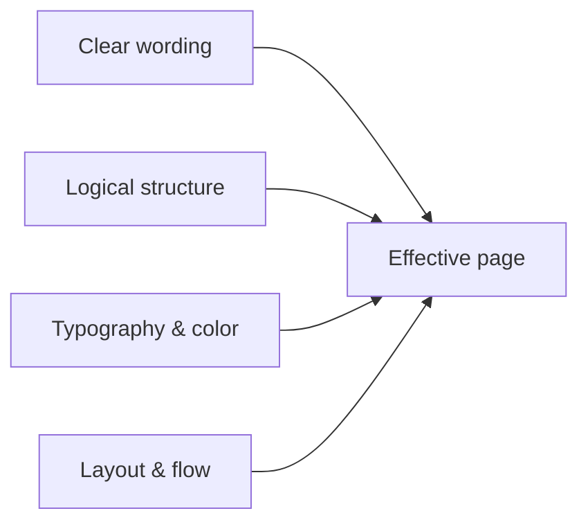

# Website Content and Presentation

This guide is about **what visitors see and read**: wording, layout of ideas, visual emphasis, and color choices that support comprehension. It complements [**Content Modeling**](../content-modeling.md) (schema and CMS structure) and [**Semantic HTML**](../semantic-html.mdx) (meaningful markup). Strong content modeling and markup still fail if paragraphs are dense, calls to action compete with each other, or contrast is too low to read comfortably.

## Goals for web content

| Goal | What it means in practice |
|------|---------------------------|
| **Scannable** | Headings, lists, and short paragraphs let people orient themselves before reading in depth. |
| **Focused** | Each view has a clear primary purpose; secondary paths stay visible but subordinate. |
| **Consistent** | Patterns for titles, buttons, and terminology repeat across the site so users learn the interface once. |
| **Inclusive** | Color contrast, typography, and structure work for low vision, zoom users, and keyboard navigation -- not only mouse users with ideal monitors. |

## Readability

### Language and tone

- Prefer **plain language**: short sentences, concrete verbs, and terminology your audience already uses.
- **Front-load meaning**: put the main point in the first sentence of a section; supporting detail follows.
- Avoid **jargon without definition** on marketing pages; explain acronyms on first use when the audience is mixed.

### Typography and measure

- **Body text** benefits from a comfortable **line length** (often cited around 45--75 characters per line for Latin scripts). Very wide lines make return sweeps harder; very narrow columns break flow for fluent readers.
- **Line height** (`line-height` in CSS) around **1.4--1.6** for body copy improves readability on screens.
- **Font size**: avoid relying on sizes below ~16px CSS pixels for primary body text; many users increase zoom or default font size.

### Headings and sections

- Use a **single `<h1>`** per page for the main title; subsections use `<h2>`, then `<h3>` -- see [**Semantic HTML**](../semantic-html.mdx).
- Headings should **describe content**, not tease without context ("Learn more" is a poor heading; "Pricing for teams" is informative).
- Keep **section depth** shallow where possible: if you routinely need five heading levels, consider splitting into multiple pages or tightening structure.

### Lists and tables

- Use **bulleted lists** for parallel items; use **numbered lists** for sequences or ranked steps.
- **Tables** suit comparisons; keep columns few and add concise headers. On small screens, consider responsive patterns (stacked rows, horizontal scroll with care) so tables remain usable.

## Structure and hierarchy

### One primary job per page

Decide what the page is **for** (inform, compare, sign up, download, contact). Put that outcome in the **hero or opening**: headline, short supporting line, and the **primary action** if any.

### Progressive disclosure

- Lead with **answers**, then **evidence** (stats, quotes, specs).
- Move **edge cases and legal detail** to accordions, footnotes, or secondary pages so the main path stays short.

### Chunking

Break long articles into **sections with descriptive headings**. Within sections, **2--4 short paragraphs** usually beat one long block. When you need nuance, use a subheading instead of a semicolon chain in a single paragraph.

## Focus and visual hierarchy

### Emphasis

- **Bold** sparingly for keywords or UI labels in prose -- not whole sentences.
- **Color alone** should not carry essential meaning; pair with text or icons for status (success, error, warning).

### Calls to action (CTAs)

- **One primary CTA** per view when possible. Multiple buttons of equal weight create decision fatigue.
- Secondary actions use **outline or text** styles so the hierarchy is obvious at a glance.

### Noise reduction

- Sidebars, ads, pop-ups, and sticky bars compete for attention. Every extra widget should justify its cost in **cognitive load** and **scroll obstruction**.
- **Whitespace** is not wasted space; it groups related content and separates unrelated blocks.

## UX design patterns for content

### Navigation and orientation

- **Breadcrumbs** help on deep hierarchies; **clear nav labels** beat clever ones.
- Match **link text** to destination titles where reasonable so users know what they clicked.

### Forms and tasks

- **Label** every input; placeholders are not substitutes for labels.
- Group related fields; show **validation next to fields** with clear, actionable messages -- not only a banner at the top.

### Mobile-first content order

- Stack content so the **most important message comes first** in the DOM where possible -- not only after large hero images or irrelevant side content.

For performance implications of layout and assets, see [**Web Performance**](../web-performance.md).

## Color and contrast

### Readability first

- Body text needs sufficient contrast against its background. **WCAG 2** defines minimum contrast ratios (commonly **4.5:1** for normal text, **3:1** for large text); aiming higher helps outdoor screens and tired eyes.
- **Light gray on white** is a frequent failure mode for secondary text -- check contrast, do not trust aesthetics alone.

### Semantic color

- **Brand palettes** should include accessible pairs for text, links, and focus states -- not only hero gradients.
- **Dark mode** needs its own checks: contrast rules apply to both themes.

### Link visibility

- Do not rely only on color: **underline** links in body copy (or a clear non-color style) so they are identifiable for color-blind users and in black-and-white prints.

## Images, charts, and media

- **Alternative text** describes the **purpose** of the image; decorative images use empty `alt=""` so assistive tech can skip them.
- **Charts**: provide a short textual summary or data table when the chart carries critical information.
- **Autoplay** video or audio is disruptive; prefer user-initiated play and **captions** for spoken content.

## Quick checklist

| Area | Question |
|------|------------|
| Readability | Are paragraphs short, headings descriptive, and line length comfortable? |
| Focus | Is there one clear primary action and a calm visual hierarchy? |
| Color | Do text and interactive elements meet contrast expectations in light and dark themes? |
| Structure | Does the first screen answer the user's main question? |
| Accessibility | Are links identifiable without color alone; images and media appropriately described? |

## Related reading

- [**Content Modeling**](../content-modeling.md) -- types, fields, and CMS-level structure
- [**Semantic HTML**](../semantic-html.mdx) -- meaningful elements and accessibility hooks
- [**Web Performance**](../web-performance.md) -- speed, images, and Core Web Vitals
- [**CSS: Colors and Typography**](../css/beginners-guide/04-colors-and-typography.md) -- fonts, units, and color in stylesheets
