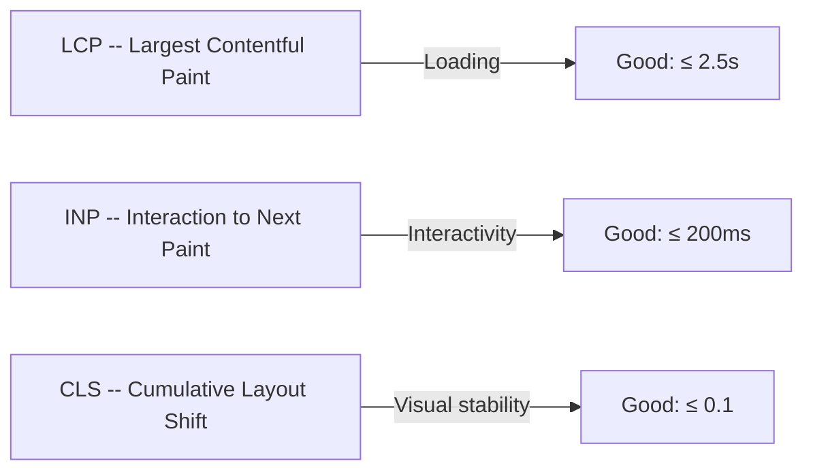
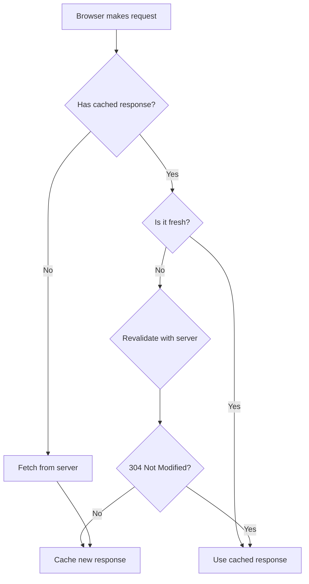
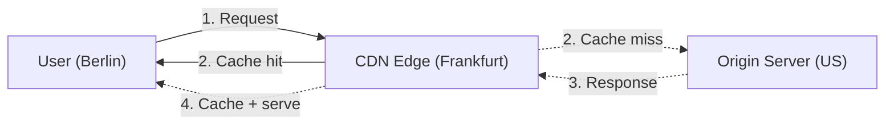

# Web Performance

A fast website is not optional -- it affects user experience, conversion rates, SEO rankings, and accessibility. This guide covers the metrics, techniques, and strategies that matter most.

## Core Web Vitals

Google's Core Web Vitals are the three metrics that define a good user experience:



### LCP -- Largest Contentful Paint

Measures **loading performance**: how long until the largest visible element (hero image, heading block, video poster) is rendered.

| Rating | Threshold |
|--------|-----------|
| Good | ≤ 2.5 seconds |
| Needs improvement | 2.5 -- 4.0 seconds |
| Poor | > 4.0 seconds |

**Common LCP elements:** hero images, `<h1>` text blocks, video poster frames, large SVGs.

**What hurts LCP:**

- Slow server response (high TTFB)
- Render-blocking CSS or JavaScript
- Large, unoptimized images
- Lazy-loading the LCP element (do **not** lazy-load the hero)

**What helps LCP:**

- Preload the LCP image: `<link rel="preload" as="image" href="hero.webp">`
- Use a CDN to reduce server latency
- Inline critical CSS
- Set `fetchpriority="high"` on the LCP image

### INP -- Interaction to Next Paint

Measures **interactivity**: how long between a user action (click, tap, keypress) and the next visual update.

| Rating | Threshold |
|--------|-----------|
| Good | ≤ 200 ms |
| Needs improvement | 200 -- 500 ms |
| Poor | > 500 ms |

**What hurts INP:**

- Long JavaScript tasks (> 50ms) blocking the main thread
- Heavy event handlers
- Layout thrashing (reading then writing DOM in a loop)
- Third-party scripts competing for the main thread

**What helps INP:**

- Break long tasks with `requestIdleCallback` or `scheduler.yield()`
- Debounce input handlers
- Use `requestAnimationFrame` for visual updates
- Move heavy work to Web Workers

### CLS -- Cumulative Layout Shift

Measures **visual stability**: how much visible content moves unexpectedly during loading.

| Rating | Threshold |
|--------|-----------|
| Good | ≤ 0.1 |
| Needs improvement | 0.1 -- 0.25 |
| Poor | > 0.25 |

**What causes CLS:**

- Images without dimensions (`width`/`height` attributes or CSS `aspect-ratio`)
- Ads, embeds, or iframes that resize after load
- Web fonts causing text reflow (FOIT/FOUT)
- Dynamically injected content above the fold

**What prevents CLS:**

- Always set `width` and `height` on images and videos
- Use `aspect-ratio` in CSS for responsive containers
- Reserve space for ads and embeds
- Use `font-display: optional` to avoid font-swap layout shifts

## Measuring performance

### Lab tools (synthetic)

| Tool | What it does |
|------|-------------|
| **Lighthouse** (Chrome DevTools) | Full audit: performance, accessibility, SEO, best practices |
| **PageSpeed Insights** | Lighthouse + field data from Chrome User Experience Report |
| **WebPageTest** | Filmstrip view, waterfall chart, multi-location testing |
| **Chrome DevTools Performance panel** | Flame chart for main thread activity, long tasks, layout shifts |

### Field data (real users)

| Source | What it provides |
|--------|-----------------|
| **CrUX** (Chrome User Experience Report) | Real-user CWV data, available via PageSpeed Insights and BigQuery |
| **web-vitals.js** | JavaScript library to measure CWV in production and send to analytics |
| **RUM** (Real User Monitoring) | Services like Datadog, New Relic, Vercel Analytics |

**Lab vs field:**

| | Lab | Field |
|--|-----|-------|
| **Consistency** | Reproducible, controlled | Varies by device, network, location |
| **Debugging** | Easy -- you control the environment | Hard -- aggregate data only |
| **Reflects real users** | No -- tests one device/network | Yes -- actual user experiences |
| **Use for** | Development, debugging, CI gates | Monitoring, trending, SEO impact |

Always look at both. Lab catches regressions during development; field confirms the impact on real users.

## Images

Images are typically the heaviest assets on a page. Optimizing them has the biggest impact on LCP and total page weight.

### Modern formats

| Format | Use for | Savings vs JPEG |
|--------|---------|----------------|
| **WebP** | Photos, illustrations | ~25--35% smaller |
| **AVIF** | Photos (best compression) | ~40--50% smaller |
| **SVG** | Icons, logos, illustrations | Scalable, tiny for simple shapes |
| **PNG** | Screenshots, images with transparency | Lossless but large |

### The `<picture>` element

Serve the best format the browser supports:

```html
<picture>
    <source srcset="hero.avif" type="image/avif">
    <source srcset="hero.webp" type="image/webp">
    
</picture>
```

### Responsive images

Serve different sizes for different viewports:

```html

```

### Image best practices

- **Always set dimensions** -- `width` and `height` attributes prevent CLS
- **Lazy-load below-the-fold images** -- `loading="lazy"` on ``
- **Do NOT lazy-load the LCP image** -- it must load immediately
- **Use `fetchpriority="high"`** on the LCP image
- **Use `decoding="async"`** on non-critical images
- **Compress images** -- aim for 80--85% quality, rarely noticeable below that
- **Use an image CDN** (Cloudinary, imgix, Vercel Image Optimization) for automatic resizing and format conversion

## Fonts

Web fonts can cause both layout shifts (CLS) and render delays (LCP).

### font-display values

| Value | Behavior | CLS risk |
|-------|----------|----------|
| `swap` | Show fallback immediately, swap when loaded | Medium -- text reflows on swap |
| `optional` | Show fallback, use web font only if already cached | None -- no swap |
| `fallback` | Brief invisible period (100ms), then fallback, then swap | Low |
| `block` | Invisible text for up to 3 seconds | None, but FOIT (flash of invisible text) |

**Recommendation:** Use `font-display: optional` for body text (avoids all layout shift). Use `swap` only if the brand font is critical to the design.

### Font loading strategies

```html
<!-- Preload the most critical font -->
<link rel="preload" as="font" type="font/woff2"
      href="/fonts/inter-v13-latin-400.woff2" crossorigin>
```

- **Self-host fonts** instead of loading from Google Fonts -- avoids a DNS lookup, connection, and the Google Fonts CSS file
- **Use WOFF2** -- best compression, supported by all modern browsers
- **Subset fonts** -- include only the character sets you need (latin, latin-ext)
- **Limit font weights** -- every weight is a separate file; use 2--3 weights maximum

### Preventing layout shift from fonts

```css
/* Match fallback metrics to the web font */
@font-face {
    font-family: "Inter";
    src: url("/fonts/inter-400.woff2") format("woff2");
    font-display: optional;
    font-weight: 400;
}

body {
    font-family: "Inter", system-ui, -apple-system, sans-serif;
}
```

Using `font-display: optional` combined with preloading gives you the web font on repeat visits (cached) and the system font on first visit (no layout shift).

## JavaScript

### Code splitting

Load only the JavaScript needed for the current page:

```javascript
// Dynamic import -- loaded on demand
const module = await import('./heavy-chart-library.js');
```

Frameworks handle this automatically:

| Framework | How |
|-----------|-----|
| **Next.js** | `next/dynamic`, automatic page-level splitting |
| **React** | `React.lazy()` + `Suspense` |
| **Vanilla** | Dynamic `import()` |

### Script loading

```html
<!-- Blocks parsing (bad for performance) -->
<script src="app.js"></script>

<!-- Downloads in parallel, executes after HTML is parsed (good) -->
<script src="app.js" defer></script>

<!-- Downloads in parallel, executes immediately when ready (for independent scripts) -->
<script src="app.js" async></script>
```

| Attribute | Download | Execution | Use for |
|-----------|----------|-----------|---------|
| (none) | Blocks parsing | Immediately | Almost never |
| `defer` | Parallel | After HTML parsed, in order | App scripts |
| `async` | Parallel | Immediately when ready, any order | Analytics, ads |

### Tree shaking

Bundlers (webpack, Rollup, esbuild) remove unused exports from your bundles. For it to work:

- Use **ES modules** (`import`/`export`), not CommonJS (`require`)
- Avoid side effects in modules
- Mark packages as side-effect-free in `package.json`: `"sideEffects": false`

### Avoiding long tasks

A **long task** is any JavaScript execution that takes longer than 50ms, blocking the main thread and hurting INP.

- Break large loops with `requestIdleCallback` or `scheduler.yield()`
- Defer non-critical work to after the page loads
- Use Web Workers for CPU-intensive computation (parsing, sorting, image processing)
- Profile with Chrome DevTools Performance panel -- look for long yellow bars

## CSS

### Critical CSS

Inline the CSS needed to render above-the-fold content in the `<head>`:

```html
<head>
    <style>
        /* Critical: header, hero, navigation */
        .header { ... }
        .hero { ... }
    </style>
    <!-- Defer the full stylesheet -->
    <link rel="preload" as="style" href="/styles.css"
          onload="this.onload=null;this.rel='stylesheet'">
</head>
```

Tools like `critical` (npm) extract critical CSS automatically.

### Reducing CSS

- **Remove unused CSS** -- tools: PurgeCSS, Tailwind's built-in purge, Coverage tab in Chrome DevTools
- **Avoid `@import`** in CSS files -- it creates sequential requests; use bundler imports instead
- **Use `content-visibility: auto`** on below-the-fold sections -- skips rendering until the element is near the viewport

### Avoiding render-blocking CSS

All `<link rel="stylesheet">` tags block rendering by default. Mitigation:

- Inline critical CSS (above)
- Use `media` attributes for conditional styles: `<link rel="stylesheet" href="print.css" media="print">`
- Load non-critical CSS asynchronously with the preload pattern

## Caching strategy

Caching is the single most effective performance optimization. A cached response has zero latency.

### HTTP cache headers



### Cache-Control

The primary header for controlling caching:

| Directive | Meaning | Use for |
|-----------|---------|---------|
| `public, max-age=31536000, immutable` | Cache for 1 year, never revalidate | Hashed static assets (`app.a1b2c3.js`) |
| `public, max-age=3600` | Cache for 1 hour | API responses, HTML pages |
| `no-cache` | Always revalidate before using cached version | HTML pages (ensures fresh content) |
| `no-store` | Never cache | Sensitive/authenticated content |
| `stale-while-revalidate=60` | Serve stale while fetching fresh in background | Good for most content |

### Cache busting with hashed filenames

Include a content hash in filenames so the URL changes when the content changes:

```
styles.a1b2c3d4.css  (hash changes when CSS changes)
app.e5f6g7h8.js      (hash changes when JS changes)
```

These files can be cached forever (`immutable`). When you deploy a new version, the HTML references a new filename, bypassing the cache.

### CDN caching



CDNs cache content at edge locations close to users. Benefits:

- **Lower latency** -- content served from a nearby server
- **Reduced origin load** -- the origin handles fewer requests
- **DDoS protection** -- CDN absorbs traffic spikes

Set appropriate `Cache-Control` headers so the CDN knows what to cache and for how long.

### stale-while-revalidate

A powerful pattern for balancing freshness and speed:

```
Cache-Control: max-age=60, stale-while-revalidate=3600
```

- For the first 60 seconds: serve from cache (fresh)
- After 60 seconds but within 3600 seconds: serve stale response **immediately**, fetch fresh in the background
- After 3600 seconds: fetch fresh (normal cache miss)

Users always get an instant response; freshness is maintained in the background.

## Server and network

### HTTP/2 and HTTP/3

| Protocol | Key improvement |
|----------|----------------|
| **HTTP/1.1** | One request per connection (or limited pipelining) |
| **HTTP/2** | Multiplexing -- many requests over one connection |
| **HTTP/3** | QUIC (UDP-based) -- faster connection setup, better on lossy networks |

With HTTP/2+, techniques like domain sharding and CSS sprites are **no longer needed** (they can actually hurt). Focus on reducing the total number of bytes instead.

### Compression

| Algorithm | Compression ratio | Browser support |
|-----------|------------------|-----------------|
| **Brotli** | Best (~15--25% smaller than gzip) | All modern browsers |
| **gzip** | Good | Universal |

Most servers and CDNs support both. Brotli is the default choice for static assets.

### Resource hints

Tell the browser what to fetch ahead of time:

```html
<!-- Preconnect: establish connection early (DNS + TCP + TLS) -->
<link rel="preconnect" href="https://fonts.googleapis.com">

<!-- Preload: fetch a critical resource early -->
<link rel="preload" as="image" href="/hero.webp">
<link rel="preload" as="font" type="font/woff2" href="/inter.woff2" crossorigin>

<!-- Prefetch: fetch a resource the user might need next (low priority) -->
<link rel="prefetch" href="/next-page.html">

<!-- DNS-prefetch: resolve DNS early (cheaper than preconnect) -->
<link rel="dns-prefetch" href="https://analytics.example.com">
```

| Hint | When to use |
|------|-------------|
| `preconnect` | Third-party origins you will definitely use (fonts, API) |
| `preload` | Critical resources the browser would discover late (fonts, LCP image) |
| `prefetch` | Resources for the next page (navigation) |
| `dns-prefetch` | Third-party origins you might use (analytics, ads) |

## Performance budgets

A performance budget sets hard limits on metrics. If a build exceeds the budget, it fails.

### What to budget

| Metric | Example budget | Why |
|--------|---------------|-----|
| **Total JS size** | ≤ 300 KB (compressed) | JS is the most expensive resource per byte |
| **Total CSS size** | ≤ 100 KB (compressed) | Render-blocking |
| **Total image weight** | ≤ 500 KB per page | Largest contributor to page weight |
| **LCP** | ≤ 2.5 seconds | Core Web Vital threshold |
| **Total page weight** | ≤ 1.5 MB | Good baseline for mobile |
| **Number of requests** | ≤ 50 | Reduce overhead |

### Enforcing budgets

- **webpack:** `performance.maxAssetSize` and `performance.maxEntrypointSize` in config
- **Lighthouse CI:** Set assertions in `lighthouserc.json`
- **bundlesize:** CLI tool that fails CI if bundles exceed limits
- **Import Cost** (VS Code extension): shows the size of imported packages inline

```json
// Example: Lighthouse CI budget
{
    "ci": {
        "assert": {
            "assertions": {
                "categories:performance": ["error", { "minScore": 0.9 }],
                "resource-summary:script:size": ["error", { "maxNumericValue": 300000 }],
                "largest-contentful-paint": ["error", { "maxNumericValue": 2500 }]
            }
        }
    }
}
```

## Anti-patterns

Common mistakes that tank performance:

| Anti-pattern | Problem | Fix |
|-------------|---------|-----|
| **Render-blocking `<script>` in `<head>`** | Delays all rendering | Use `defer` or move to end of `<body>` |
| **Unoptimized third-party scripts** | Analytics, chat widgets, A/B testing block the main thread | Load async, defer non-critical, audit regularly |
| **Images without dimensions** | CLS from layout shifts | Always set `width`/`height` or `aspect-ratio` |
| **Lazy-loading the LCP image** | Delays the most important visual element | Eager-load the hero image, set `fetchpriority="high"` |
| **Loading all JS upfront** | Huge initial bundle | Code-split per route/page |
| **CSS `@import` chains** | Sequential network requests | Bundle CSS with your build tool |
| **Layout thrashing** | Reading then writing DOM in a loop | Batch reads, then batch writes |
| **Excessive DOM size** | > 1500 nodes slows everything | Virtualize long lists, simplify structure |
| **No caching headers** | Every visit re-fetches everything | Set `Cache-Control` on all static assets |
| **Uncompressed assets** | 2-3x larger than necessary | Enable Brotli/gzip on your server |

## Platform-specific resources

These guides cover performance in the context of specific platforms used in this documentation:

**AEM:**

- [Dispatcher Configuration](/aem/infrastructure/dispatcher-configuration) -- caching at the Dispatcher layer
- [Performance](/aem/infrastructure/performance) -- AEM-specific performance optimization

**Strapi:**

- [Performance and Caching](/strapi/performance-and-caching) -- API response caching, database optimization

**JavaScript:**

- [Performance Basics](/javascript/performance-basics) -- client-side JavaScript performance patterns

## Summary

| Area | Key takeaway |
|------|-------------|
| **Core Web Vitals** | LCP ≤ 2.5s, INP ≤ 200ms, CLS ≤ 0.1 -- measure both lab and field |
| **Images** | Use WebP/AVIF, responsive srcset, lazy-load (except LCP), always set dimensions |
| **Fonts** | Self-host WOFF2, preload critical font, `font-display: optional` for zero CLS |
| **JavaScript** | Code-split, `defer` scripts, break long tasks, tree-shake unused code |
| **CSS** | Inline critical CSS, remove unused CSS, avoid render-blocking stylesheets |
| **Caching** | Hash filenames for immutable caching, `stale-while-revalidate` for dynamic content |
| **Network** | Enable Brotli, use HTTP/2+, preconnect to critical origins |
| **Budgets** | Set limits on JS/CSS/image size, enforce in CI, fail the build if exceeded |
| **Anti-patterns** | Audit third-party scripts, avoid layout thrashing, never skip cache headers |
